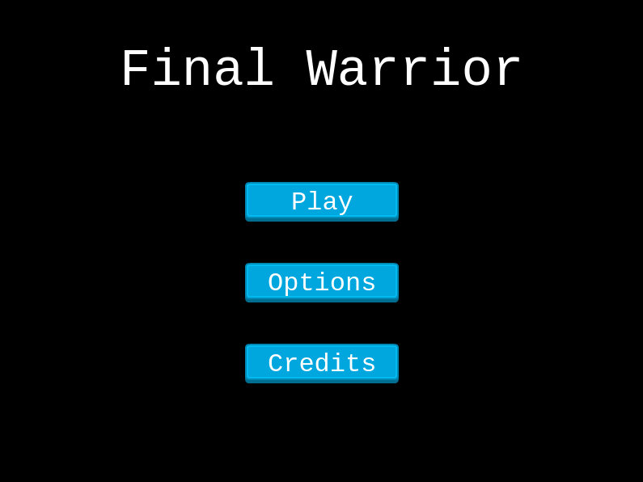

<!--
*** Thanks for checking out this README Template. If you have a suggestion that would
*** make this better, please fork the repo and create a pull request or simply open
*** an issue with the tag "enhancement".
*** Thanks again! Now go create something AMAZING! :D
-->

<!-- PROJECT SHIELDS -->
<!--
*** I'm using markdown "reference style" links for readability.
*** Reference links are enclosed in brackets [ ] instead of parentheses ( ).
*** See the bottom of this document for the declaration of the reference variables
*** for contributors-url, forks-url, etc. This is an optional, concise syntax you may use.
*** https://www.markdownguide.org/basic-syntax/#reference-style-links
-->
[![Contributors][contributors-shield]][contributors-url]
[![Forks][forks-shield]][forks-url]
[![Stargazers][stars-shield]][stars-url]
[![Issues][issues-shield]][issues-url]


<!-- PROJECT LOGO -->
<br />
<p align="center">
  <a href="https://github.com/rammazzoti2000/js_capstone_rpg">
    
  </a>

  <h3 align="center">JavaScript / Capstone --> [Final Warrior]</h3>

  <p align="center">
    This project is the Capstone of the Microverse curriculum at the end of the JavaScript module!
    <br />
    <a href="https://github.com/rammazzoti2000/js_capstone_rpg"><strong>Explore the docs »</strong></a>
    <br />
    <br />
    <a href="https://github.com/rammazzoti2000/js_capstone_rpg/issues">Report Bug</a>
    ·
    <a href="https://github.com/rammazzoti2000/js_capstone_rpg/issues">Request Feature</a>
  </p>
</p>

<!-- TABLE OF CONTENTS -->
## Table of Contents

* [About the Project](#about-the-project)
  * [Built With](#built-with)
  * [Walkthrough Video and Deployment (GitHub-Pages)](#walkthrough-video-and-deployment-(gitHub-pages))
* [Usage](#usage)
* [Contributors](#contributors)
* [Acknowledgements](#acknowledgements)
* [License](#license)

<!-- ABOUT THE PROJECT -->
## About The Project

This is the Capstone project that signs the completion of the JavaScript module in Microverse Curriculum.
It is an RPG game, specifically a platform game. The main inspiration was from multiplayer online games.
In this particular game the action is mainly focused on collecting as many chests as possible while having to combat against monsters (also covid monsters are present as well).

### How to Play


The game can be played using the arrow keys for moving the player and the spacebar for attacking the monster.
By moving the player you will be able to collect chests that contain gold. Each chest will update the score with a random amount between 20 and 30 golds.
Each character has a health bar, player included. The monster's health bar will decrease each time the player will attack, but watch out, the monsters have a random movement and each time you will attack they will fight back making your health bar decrease.
As a bonus though, for each monster killed the player will have back some gold and some life to increase his health bar.

### Design Process

Fatal Warrior was designed on an initial, quite complex, webpack configuration specific for Phaser3. This allowed me to investigate Phaser and its tools from a specific perspective. The entire map was built with Tiled on a 32 x 32 collection of squares. The map then has been exported as a json file and used for placing chests, and monsters at random positions.

The player has a set velocity and can move across the map by using the arrow keys. Each time the player dies it will be spawned at a different random position to make the game more interesting. The monsters and the chests will be as well randomly generated and spawned on the map. Each spawned element has a random unique id used to interact with the user. The unique id is generated with the help of uuid npm package.

### Built With
This project was built using these technologies.
* JavaScript
* Phaser3
* Webpack
* Jest Tests
* Tiled Map
* GithubActions :muscle:
* Atom :atom:

<!-- Live Demo -->
## Walkthrough Video and Deployment (GitHub-Pages)
https://www.loom.com/share/291f99a17d0542e09a48fd3f7c0e83cc
##
* Live Demo Link --> App Deployed with GitHub-Pages: [Final Warrior](https://rammazzoti2000.github.io/js_capstone_rpg/) :point_left:

## Screenshots



### Getting Started

To get a local copy up and running follow these simple example steps.

### Prerequisites

 * [Node.js](https://nodejs.org/) is required to install dependencies and run scripts via npm.
 * A modern browser

### Clone
* [download](https://github.com/rammazzoti2000/js_capstone_rpg/archive/development.zip) or clone this repo:
  - Clone with SSH:
  ```
    git@github.com:rammazzoti2000/js_capstone_rpg.git
  ```
  - Clone with HTTPS
  ```
    https://github.com/rammazzoti2000/js_capstone_rpg.git

### Setup

Install dependencies:

```
$ npm install
```

Start the local webserver:

```$ npm start``` > will open a local webserver at http://localhost:8080/ directly in your default browser with the game ready to be played

  ## Automated Test

* Run the command and see the output:
```$ npm run test```


 ## Potential future features
- Extend the game to a multiplayer online game
- Add authentication process

<!-- CONTACT -->
## Contributors

👤 **Alexandru Bangau**

- LinkedIn: [Alexandru Bangau](https://www.linkedin.com/in/alexandru-bangau/)
- GitHub: [@rammazzoti2000](https://github.com/rammazzoti2000)
- E-mail: bangau.alexandru@gmail.com
- Project [Link](https://github.com/rammazzoti2000/js_capstone_rpg/)

## :handshake: Contributing

Contributions, issues and feature requests are welcome!

Feel free to check the [issues page](https://github.com/rammazzoti2000/js_capstone_rpg/issues).

## Show your support

Give a :star: if you like this project!


<!-- ACKNOWLEDGEMENTS -->
## Acknowledgements
* [Sound Theme](https://www.youtube.com/watch?v=jhUkGIsKvn0) - Everybody was kung fu fighting by Carl Douglas
* [SFX effects](https://opengameart.org/) - OpenGameArt website
* [Phaser3](https://phaser.io/phaser3) & [Phaser Template](https://github.com/rammazzoti2000/phaser_toolbox)
* [Sprites and Tiles](https://github.com/rammazzoti2000/) - ale[x360]
* [Microverse](https://www.microverse.org/)


<!-- MARKDOWN LINKS & IMAGES -->
<!-- https://www.markdownguide.org/basic-syntax/#reference-style-links -->
[contributors-shield]: https://img.shields.io/github/contributors/rammazzoti2000/js_capstone_rpg.svg?style=flat-square
[contributors-url]: https://github.com/rammazzoti2000/js_capstone_rpg/graphs/contributors
[forks-shield]: https://img.shields.io/github/forks/rammazzoti2000/js_capstone_rpg.svg?style=flat-square
[forks-url]: https://github.com/rammazzoti2000/js_capstone_rpg/network/members
[stars-shield]: https://img.shields.io/github/stars/rammazzoti2000/js_capstone_rpg.svg?style=flat-square
[stars-url]: https://github.com/rammazzoti2000/js_capstone_rpg/stargazers
[issues-shield]: https://img.shields.io/github/issues/rammazzoti2000/js_capstone_rpg.svg?style=flat-square
[issues-url]: https://github.com/rammazzoti2000/js_capstone_rpg/issues

## 📝 License

This project is [MIT](https://opensource.org/licenses/MIT) licensed.
